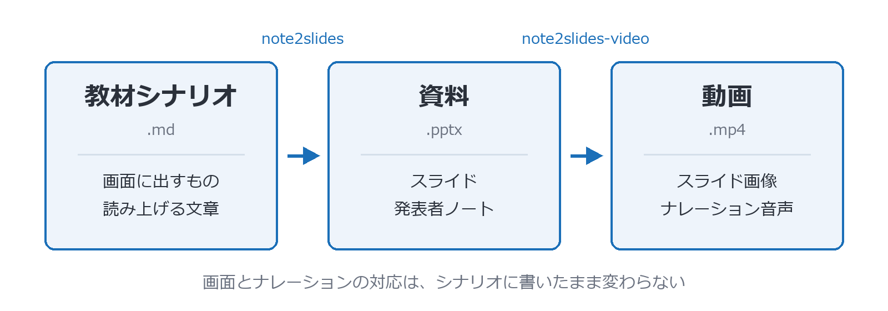

## 教材シナリオから動画を作る

### 設定

- レイアウト: 表紙

### 画面

note2slides / 教材シナリオのサンプル

### ナレーション

この教材では、教材シナリオから、ナレーション付きの動画を作る方法を説明します。

教材シナリオは、画面に出すものと、そこで読み上げる文章を、あらかじめ決めて書いたものです。

## この教材で学ぶこと

### 画面

- 教材シナリオが、記事と何が違うのか
- 画面とナレーションを、どう書き分けるのか
- シナリオから動画までの、三つの工程

### ナレーション

この教材で学ぶことは三つです。

一つ目は、教材シナリオが記事と何が違うのかです。

二つ目は、画面に出す内容と、読み上げる文章の書き分け方です。

三つ目は、シナリオから動画ができるまでの工程です。

## 記事から作るときとの違い

### 画面

記事を入力にすると、記事の文章構造から動画の構成を組み立てます。
書かれている順番のまま、文章がそのまま画面に出て、そのまま読み上げられます。

教材シナリオは、その逆です。
どの画面に何を出し、そこで何を説明するかを先に決めて、そのとおりに動画にします。

### ナレーション

まず、記事から作るときとの違いを見ていきます。

記事を入力にした場合は、記事の文章構造から動画の構成を組み立てます。書かれている順番のまま、文章がそのまま画面に出て、そのまま読み上げられます。

教材シナリオは、その逆です。どの画面に何を出し、そこで何を説明するかを、書いた人が先に決めます。画面に出す文字と、読み上げる文章を、別々に書けます。

## 教材シナリオから動画ができるまで

### 設定

- 見る時間: 2

### 画面

工程は三つあります。シナリオを書き、資料を作り、動画にします。



### ナレーション

画面の図をご覧ください。

左から順に、教材シナリオ、資料、動画と並んでいます。

まず、教材シナリオに、画面に出すものと読み上げる文章を書きます。

次に、シナリオから資料を作ります。画面に出すものはスライドになり、読み上げる文章は発表者ノートに入ります。

最後に、資料から動画を作ります。スライドは画像に、発表者ノートはナレーション音声になります。

画面とナレーションの対応は、この間ずっと変わりません。シナリオに書いたものが、そのまま動画になります。

## シナリオの書き方

### 画面

見出しで、画面とナレーションを分けて書きます。

```markdown
## スライドの見出し

### 画面
画面に出す文章や箇条書き

### ナレーション
この画面で読み上げる文章
```

### ナレーション

書き方は簡単です。

画面のとおり、見出し二つのシャープで画面を一枚作り、その下に、画面とナレーションを書きます。

見出しがそのままスライドのタイトルになります。画面に書いたものがスライドに出て、ナレーションに書いた文章が読み上げられます。

一つの画面に書いたナレーションは、その画面が映っている間だけ読み上げられます。

## それぞれの見出しの役割

### 画面

| 見出し | 書くもの | 動画での扱い |
| --- | --- | --- |
| 画面 | 文章・箇条書き・図・表 | スライドに表示する |
| ナレーション | 読み上げる文章 | その画面の音声になる |
| 設定 | レイアウト・見る時間 | 見せ方を決める |

画面とナレーションは、どちらも省略できます。

### ナレーション

画面の表をご覧ください。

見出しは三つあります。

画面には、文章、箇条書き、図、表を書きます。ここに書いたものが、スライドに表示されます。

ナレーションには、読み上げる文章を書きます。ここに書いた文章が、その画面の音声になります。

設定には、レイアウトや、画面を見せる時間を書きます。図をゆっくり見せたいときは、ここで秒数を指定します。

表の下に書いたとおり、画面とナレーションは、どちらも省略できます。画面だけの画面も、音声だけの画面も作れます。

## 一つの画面に複数の中身を置く

### 設定

- 見る時間: 2

### 画面

一つの画面には、文章と図、表と補足の文のように、複数の中身を並べられます。

```markdown
### 画面

図の見方を説明します。


```

書いた順に、上から下へ並びます。

### ナレーション

一つの画面には、複数の中身を並べられます。

画面のコードをご覧ください。画面の見出しの下に、文章と図を続けて書いています。この二つは、一枚の画面に上下に並んで出ます。

並ぶ順番は、シナリオに書いた順です。文章を先に書けば文章が上に、図を先に書けば図が上になります。

ナレーションは、画面ごとに一つのままです。中身が増えても、その画面全体について説明する文章を書いてください。

## まとめ

### 設定

- 見る時間: 3

### 画面

- 画面とナレーションは、シナリオに書いたとおりになる
- 一つの画面に、文章と図・表・コードを並べられる
- 直したいところは、シナリオを直してもう一度作る

### ナレーション

最後にまとめです。

教材シナリオでは、画面とナレーションが、書いたとおりになります。構成を組み立て直されることはありません。

一つの画面に、文章と図、表と補足の文のように、複数の中身を並べられます。ナレーションは、その画面全体について書いてください。

直したいところが見つかったら、シナリオを直して、もう一度作ってください。

この教材は以上です。
